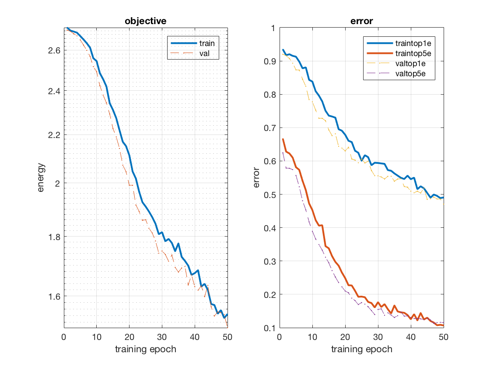
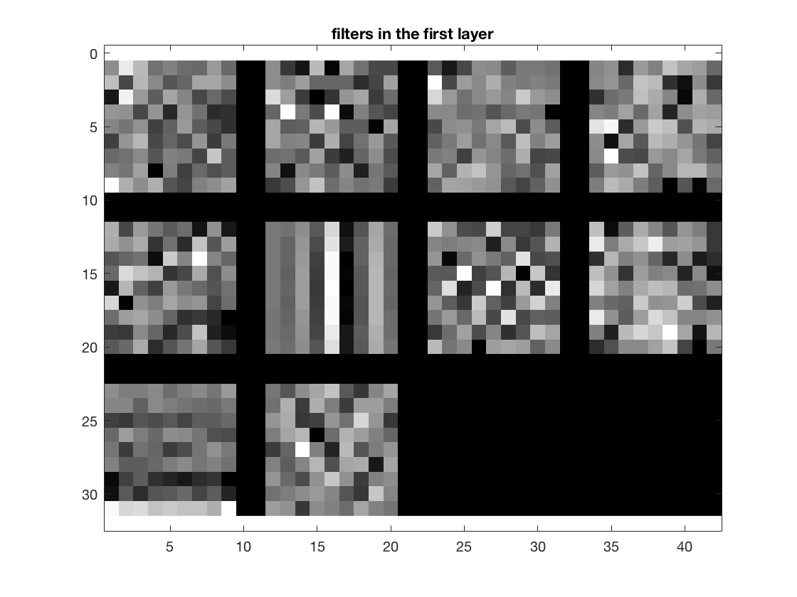

Project 6 / Deep Learning
-------------------------

Before deep learning, the pipeline for processing an image for some propblem
was to:

+ Get some hand crafted features from training images
+ Learn some classification from those features
+ Run on testing images

Deep learning used features that are learned instead of being hand-crafted
Without training data, these learned features perform very poorly, and even
with large amounts of training data, the structure of a deep network can
still be very inaccurate. However, with enough training data, and properly
structured, accuracies can outperform hang crafted features by a significant
margin.

This project was structured into two parts. In both parts, a network was 
attempting to classify images into one of the 15 scenes in the 15 scene
database. In part one, a shallow network was trained from scratch, while
in part two a pre-trained deep network was fine tuned.

###Training From Scratch

In this part, a shallow network was provided, but out of the box performed
very poorly acheiving an accuracy of around <b>25%</b>. Before editing the
networks design, a couple changes were made to the inputs to help improve
accuracy.

+ Jittering (mirroring) 50% of images in each batch
+ Zero centering every image
+ Regularizing the network with a dropout layer

With these changes, an accuracy of around <b>60%</b> was acheived after
30 epochs.

####Going Deeper

One major problem of our network is that it isn't deep. Depth
allows better features to be learned, and as our original network
only had 2 layers with learned parameters, going deeper should
help with improving accuracies. This was not really the case in
practice however. Adding an additional convolution and max pool
layer actually worsened accuracies in some cases. It was only after
the padding was increased in the second convolutional layer that accuracy
remained consistent. Ultimately, our "deeper" network achieved an
accuracy of *52.9333%* after 50 epochs.

The training and validation errors can be seen in the chart below:

To look at what the network is actually learning, the learned filters
from the first layer can be seen below:

The code that created the full network can be seen below:

    net.layers = {} ;

    net.layers{end+1} = struct('type', 'conv', ...
                           'weights', {{f*randn(9,9,1,10, 'single'),
                                   zeros(1, 10, 'single')}}, ...
                           'stride', 1, ...
                           'pad', 4, ...
                           'name', 'conv1') ;
                       
    net.layers{end+1} = struct('type', 'pool', ...
                           'method', 'max', ...
                           'pool', [7 7], ...
                           'stride', 2, ...
                           'pad', 0) ;

    net.layers{end+1} = struct('type', 'relu') ;

    net.layers{end+1} = struct('type', 'conv',...
                           'weights', {{f*randn(5,5,1,10,'single'),
                                   zeros(1, 10, 'single')}},...
                           'stride', 1,...
                           'pad', 3,...
                           'name', 'myconv1') ;
                    
    net.layers{end+1} = struct('type', 'pool',...
                           'method', 'max',...
                           'pool', [3 3],...
                           'stride', 2,...
                           'pad', 0) ;

    net.layers{end+1} = struct('type', 'relu') ;

    net.layers{end+1} = struct('type', 'dropout',...
                           'rate', 0.5) ;

    net.layers{end+1} = struct('type', 'conv', ...
                           'weights', {{f*randn(15,15,10,15, 'single'),
                                   zeros(1, 15, 'single')}}, ...
                           'stride', 1, ...
                           'pad', 0, ...
                           'name', 'fc1') ;
                      
    net.layers{end+1} = struct('type', 'softmaxloss') ;

Finding a deeper network that acheived even the same performance
as the shallow network was difficult and took a lot of tweaking.
These deep networks have a lot more variables than the previous
hand-crafted features and in some sense are a lot more difficult
to tweak than the features from before. While higher accuracies
are desired in most cases, it is almost easer to deal with the
hand crafted features from before, so they might still be useful
in certain situations.

###Fine Tuning

Sometimes, there isn't enough training data to train a whole
deep network from scratch. However, deep networks can be adapted
to be still fairly accurate at tasks than it wasn't specifically
designed to be accurate for. In the second part of the project, the
VGG-F network was fine tuned to be able to classify images into
scenes. This acheived much higher accuracies than our "deep" network
from before. This can be attriubted to the fact that our network
from before isn't actually deep, at least not like VGG-F is.

After the fine tuning, the VGG-F network could acheive an accuracy
of *88%* after 10 epochs.

Again, to help visualize what the network is learning, here are the
filters after the first convolutional layer.

To fine train an existing network, the last 2 layers of the network
are replaced with layers that will produce a proper outout for the
problem which in our case is a 15 x 1 matrix holding the how confident
the network thinks an image represents each scene. The dropout layers
for the network are also added back in for training purposes. The code for that
can be seen below.

    net.layers = [net.layers(1:16-1) {struct('type','dropout','rate',0.5)} net.layers(16:end)];

    net.layers = [net.layers(1:18-1) {struct('type','dropout','rate',0.5)} net.layers(18:end)];

    net.layers{end-1} = struct('type', 'conv', ...
                           'weights', {{(1/100)*randn(1,1,4096,15, 'single'),
                                   zeros(1, 15, 'single')}}, ...
                           'stride', 1, ...
                           'pad', 0, ...
                           'name', 'myfc8') ;
                      
    net.layers{end} = struct('type', 'softmaxloss') ;
